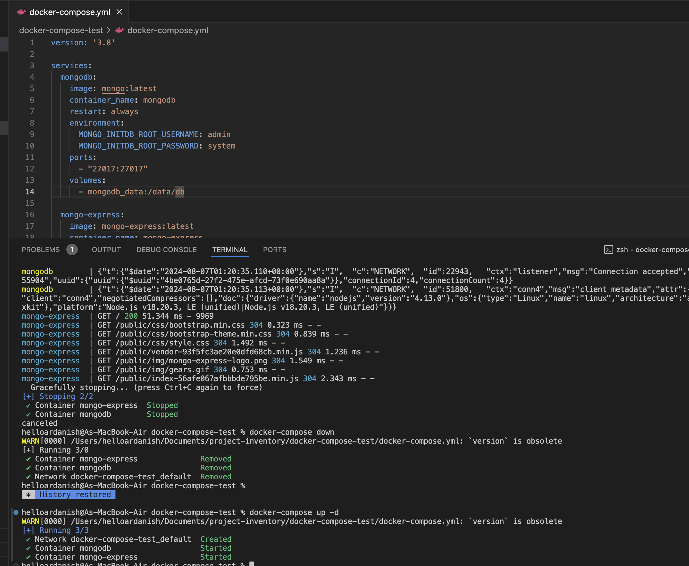
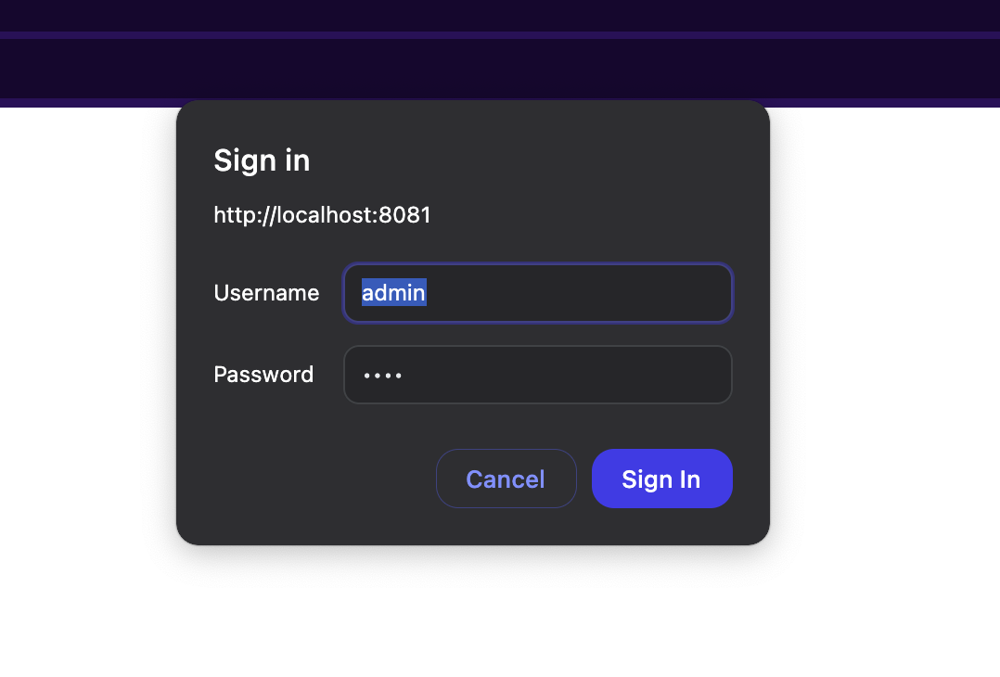
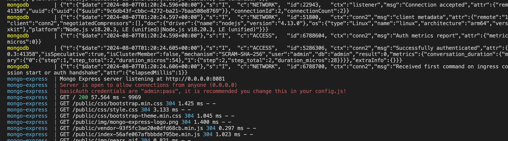
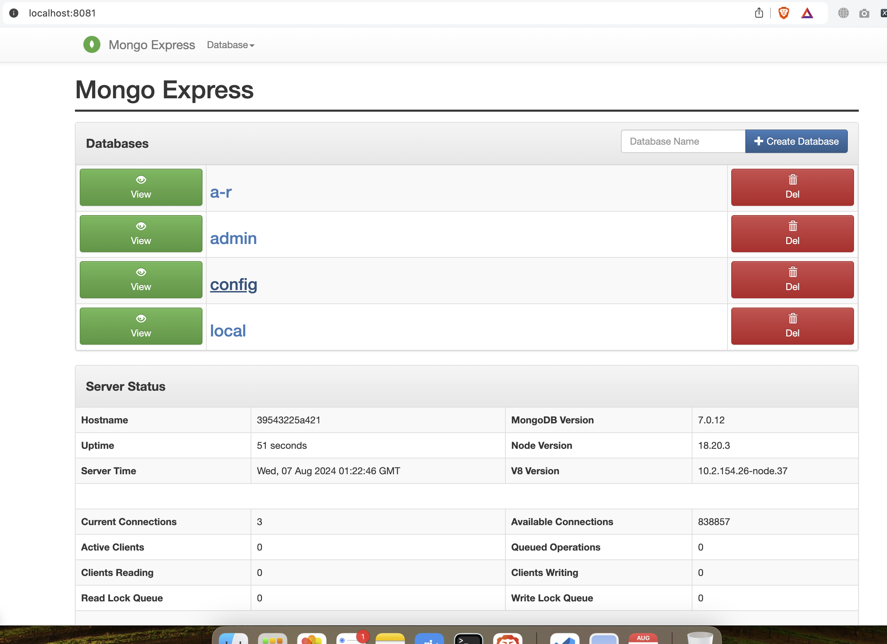
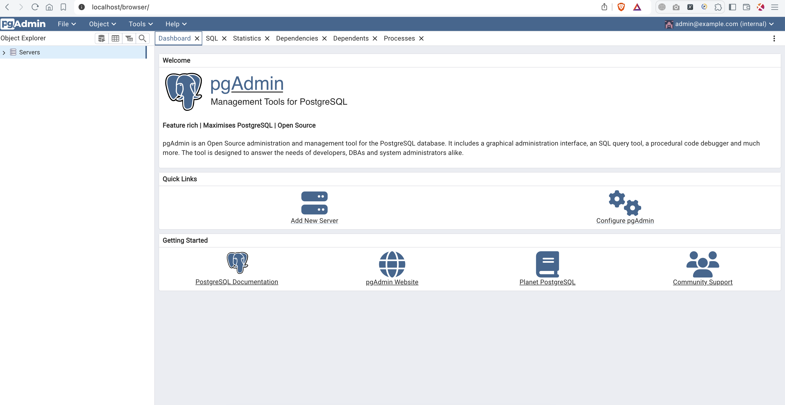
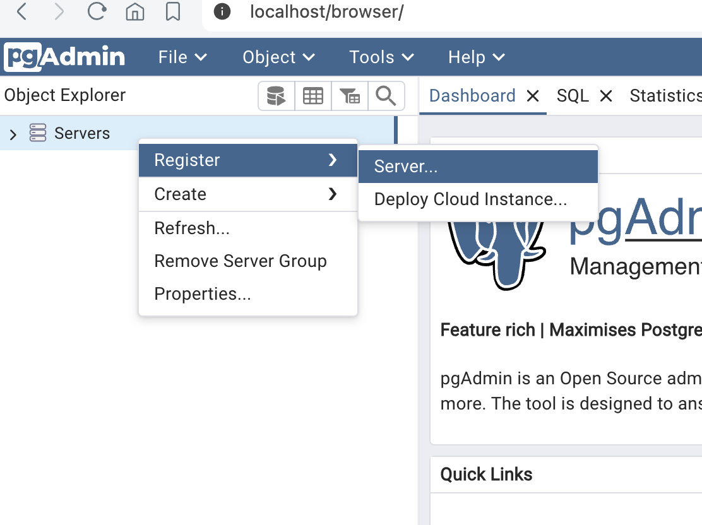
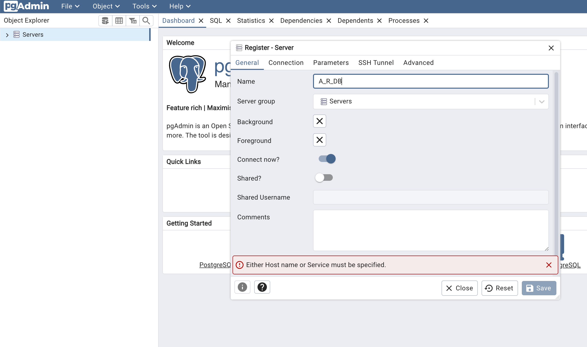
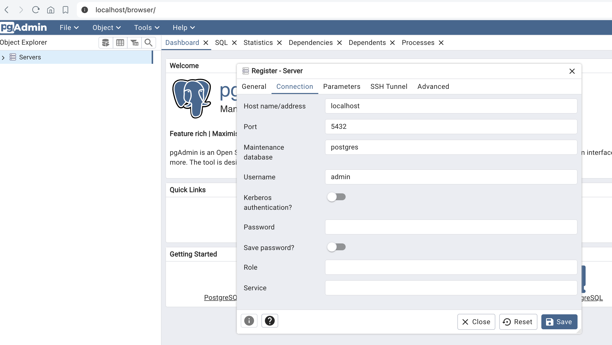

# Docker compose yaml file to run single mongodb with mongo-express

Here two services are running using docker compose.

-- compose1.yaml and compose2.yaml not working

```
To run:

docker-compose up

to run in detached mode:

docker-compose up


To down:

docker-compose down

it will not only stop but also remove the service
```



### Accessing on local

Step 1:
Enter the credentials:

By default it is admin:pass


which can be seen while starting services:


Step 2:
Now you have access to db:



a-r collection is created manully from UI.


## Postgres setup

Access using pgadmin:


Enter credentials which is configured in yaml


Welcome page:



There is no server, we can create one for use.

Register server:



Setuping server with configurations:






#### Happy coding,
## A R